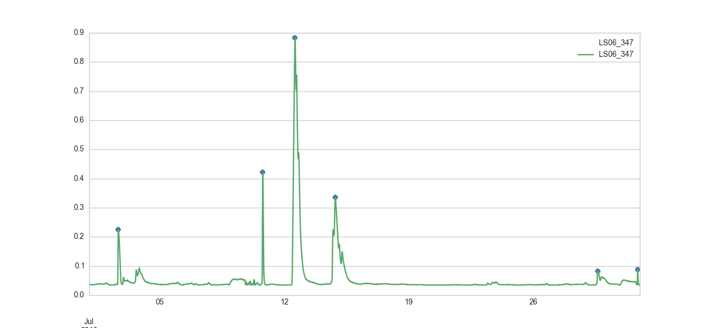
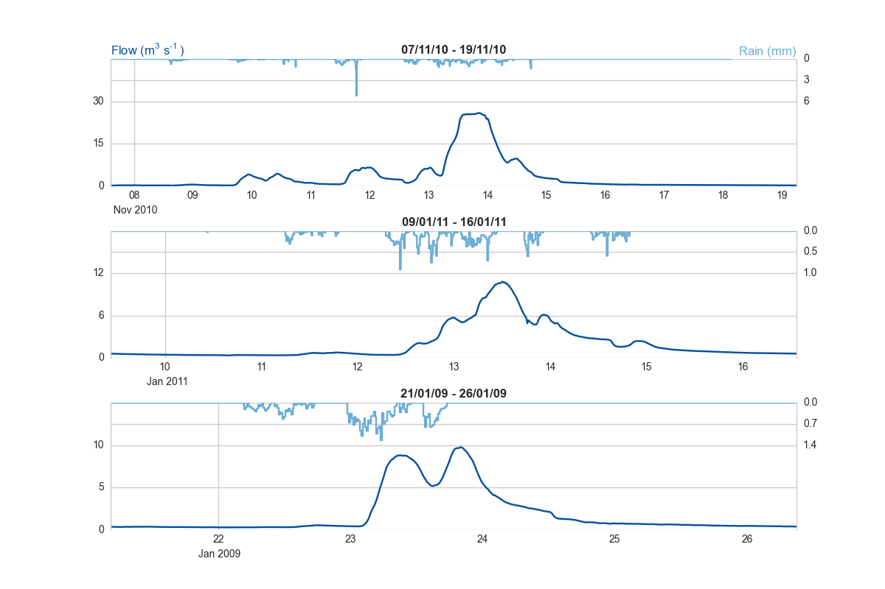

Hydropy
=======

Analysis of hydrological oriented time series. Basically, the package adds domain-specific functionalities to Pandas DataFrames, while keeping the power of it.

Examples are:

    # Recession periods in June 2011:
    myflowserie.get_year('2011').get_month("Jun").get_recess()

    # Peak values above 90th percentile for station LS06_347 in july 2010:
    myflowserie['LS06_347'].get_year('2010').get_month("Jul").get_highpeaks(150, above_percentile=0.9)

    # Select 3 storms out of the series
    storms = myflowserie.derive_storms(raindata['P06_014'], 'LS06_347', number_of_storms=3, drywindow=96, makeplot=True)

A more extended tutorial/introduction is provided in a ipython notebook. See the output at http://nbviewer.ipython.org/github/stijnvanhoey/hydropy/blob/master/hydropy_tutorial.ipynb

We acknowledge the Flemish Environmental Agency (VMM) for the data used in the tutorial. It can be downloaded from http://www.waterinfo.be/.

To install this, git clone the repo and then install it by:

    python setup.py install

Inspiration or possible useful extensions:
* Basically this is a restart of hydropy https://code.google.com/p/hydropy/
* Hydroclimpy http://hydroclimpy.sourceforge.net/
* Georgakakos2004, ROC
* http://cran.r-project.org/web/packages/hydroTSM/vignettes/hydroTSM_Vignette.pdf

The slides version of the notebook was made with nbconvert (using reveal.js), by following command:

    ipython nbconvert hydropy_tutorial.ipynb --to=slides --post=serve --reveal-prefix=reveal.js --config slides_config.py
    
http://nbviewer.ipython.org/format/slides/github/stijnvanhoey/hydropy/blob/master/hydropy_tutorial.ipynb#/

Copyright (c) 2015, Stijn Van Hoey
